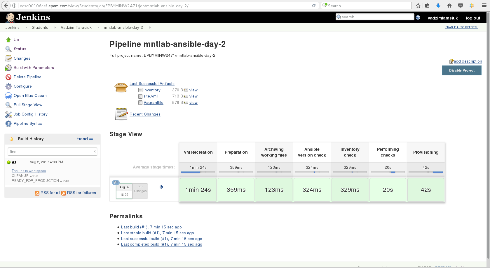
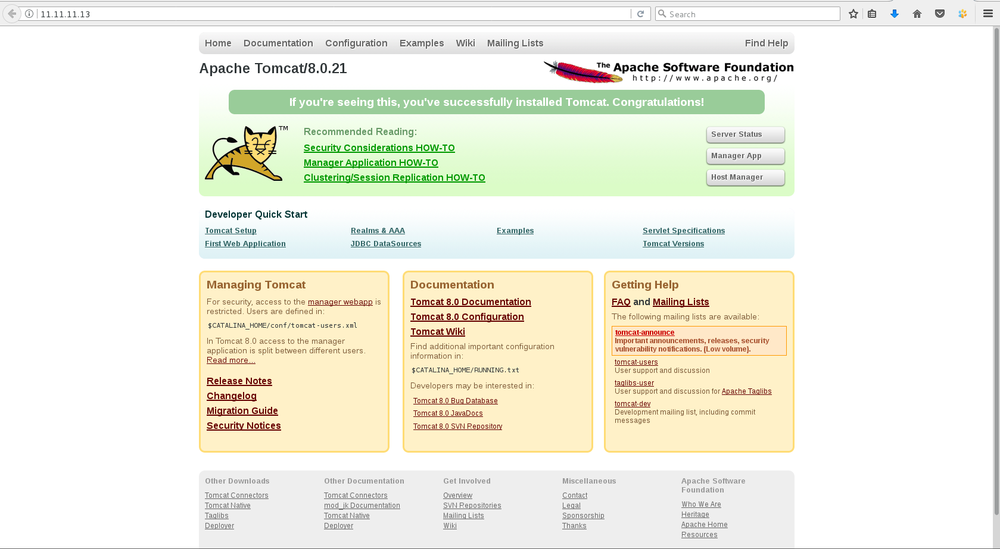

***Ansible Task 2: Vadzim Tarasiuk***

1. Create folder ~/cm/ansible/day-2. All working files are supposed to be placed right there.
2. Spin up clear CentOS6 VM using vagrant (repo with vagrantfile). Verify connectivity to the host using ssh keys (user: vagrant)
3. Create ansible inventory file (name: inventory) with remote host connection details:
* Remote VM hostname/ip/port
* Remote ssh log in username
* Connection type
```
[vagrant]
vagrant_vm 

[vagrant:vars]
ansible_port=22 
ansible_host=11.11.11.13 
ansible_user=vagrant 
ansible_connection=ssh 
ansible_ssh_private_key_file=./.vagrant/machines/ansible2/virtualbox/private_key

[local]
localhost

[local:vars]
ansible_port=22 
ansible_host=127.0.0.1 
ansible_user=student 
ansible_connection=ssh 
ansible_ssh_private_key_file=~/.ssh/id_rsa
```
4. Develop a playbook (name: site.yml) which is supposed to run against any host (specified in inventory)
__4.1 Develop roles:__
* java (installs java)
* java_test (does only checks that java installed and running properly)
* tomcat (installs tomcat)
* tomcat_test (does only checks that tomcat installed and running properly)
* nginx (installs nginx)
* nginx_test (does only checks that nginx installed and running properly)
```
[student@epbyminw2471 day-2]$ tree
.
├── inventory
├── nginx.conf
├── nginx.conf.j2
├── roles
│   ├── java
│   │   ├── defaults
│   │   │   └── main.yml
│   │   ├── handlers
│   │   │   └── main.yml
│   │   ├── meta
│   │   │   └── main.yml
│   │   ├── README.md
│   │   ├── tasks
│   │   │   └── main.yml
│   │   ├── tests
│   │   │   ├── inventory
│   │   │   └── test.yml
│   │   └── vars
│   │       └── main.yml
│   ├── java_test
│   │   ├── defaults
│   │   │   └── main.yml
│   │   ├── handlers
│   │   │   └── main.yml
│   │   ├── meta
│   │   │   └── main.yml
│   │   ├── README.md
│   │   ├── tasks
│   │   │   └── main.yml
│   │   ├── tests
│   │   │   ├── inventory
│   │   │   └── test.yml
│   │   └── vars
│   │       └── main.yml
│   ├── nginx
│   │   ├── defaults
│   │   │   └── main.yml
│   │   ├── handlers
│   │   │   └── main.yml
│   │   ├── meta
│   │   │   └── main.yml
│   │   ├── README.md
│   │   ├── tasks
│   │   │   └── main.yml
│   │   ├── tests
│   │   │   ├── inventory
│   │   │   └── test.yml
│   │   └── vars
│   │       └── main.yml
│   ├── nginx_test
│   │   ├── defaults
│   │   │   └── main.yml
│   │   ├── handlers
│   │   │   └── main.yml
│   │   ├── meta
│   │   │   └── main.yml
│   │   ├── README.md
│   │   ├── tasks
│   │   │   └── main.yml
│   │   ├── tests
│   │   │   ├── inventory
│   │   │   └── test.yml
│   │   └── vars
│   │       └── main.yml
│   ├── tomcat
│   │   ├── defaults
│   │   │   └── main.yml
│   │   ├── handlers
│   │   │   └── main.yml
│   │   ├── meta
│   │   │   └── main.yml
│   │   ├── README.md
│   │   ├── tasks
│   │   │   └── main.yml
│   │   ├── tests
│   │   │   ├── inventory
│   │   │   └── test.yml
│   │   └── vars
│   │       └── main.yml
│   └── tomcat_test
│       ├── defaults
│       │   └── main.yml
│       ├── handlers
│       │   └── main.yml
│       ├── meta
│       │   └── main.yml
│       ├── README.md
│       ├── tasks
│       │   └── main.yml
│       ├── tests
│       │   ├── inventory
│       │   └── test.yml
│       └── vars
│           └── main.yml
├── site.retry
├── site.yml
└── Vagrantfile

43 directories, 54 files

```
__4.2 Playbook should consist of 2 Plays:__
__sute.yml contents:__
```
- name: Web Service Provisioning
  hosts: vagrant
  become: yes
  become_user: root
  roles: 
  - role: nginx
  - role: tomcat 
    tomcat_version: 8.0.21 
    tomcat_user: myuser 
    tomcat_group: thisgroup 
    tomcat_home: /opt/as/tomcat 
    tomcat_version_maj: 8
  
  post_tasks:
    - name: Nginx Start and Enable
      service:
        name: nginx
        state: started
        enabled: yes

    - name: Startup and Enable Tomcat
      service:
        name: tomcat.service
        state: started
        enabled: yes


- name: Web Service Testing
  hosts: vagrant
  roles:
    - role: nginx_test
    - role: java_test
    - role: tomcat_test
```
__4.3 Use handlers to manage tomcat/nginx configuration changes__
```
# handlers file for tomcat
- name: ConfigChanged
  service: name=tomcat.service state=restarted enabled=yes

- name: DaemonChanged
  shell: 'systemctl daemon-reload && systemctl restart tomcat.service'
```
```
# handlers file for nginx
- name: ConfigChanged
  service: name=nginx state=restarted enabled=yes
```
__4.4 Use module debug to check configuration during the installation __
```
# tasks file for tomcat_test
- name: DEBUG INFO - tomcat version
  debug: var=tomcat_version
- name: DEBUG INFO - tomcat user
  debug: var=tomcat_user
- name: DEBUG INFO - tomcat group
  debug: var=tomcat_group
- name: DEBUG INFO - tomcat home
  debug: var=tomcat_home
```
```
# tasks file for java_test
- name: Check to exists current version of Java
  debug: var=java_version
```
__4.5 Define play/roles variables (at least):__
* tomcat_version
* tomcat_home
* tomcat_user
* tomcat_group
* java_version
```
# vars file for tomcat
tomcat_version_maj: 8
tomcat_version_stage: 0
tomcat_version_minor: 23
tomcat_version: "{{ tomcat_version_maj }}.{{ tomcat_version_stage }}.{{ tomcat_version_minor }}"
tomcat_user: tomcat_user
tomcat_group: tomcat_group
tomcat_home: /opt/tomcat_home
```
```
# vars file for java
java_version: 1.8.0
```

Additionally, Java starts from tomcat-role:
```
galaxy_info:
  author: your name
  description: your description
  company: your company (optional)

  # If the issue tracker for your role is not on github, uncomment the
  # next line and provide a value
  # issue_tracker_url: http://example.com/issue/tracker

  # Some suggested licenses:
  # - BSD (default)
  # - MIT
  # - GPLv2
  # - GPLv3
  # - Apache
  # - CC-BY
  license: license (GPLv2, CC-BY, etc)

  min_ansible_version: 1.2

  # If this a Container Enabled role, provide the minimum Ansible Container version.
  # min_ansible_container_version:

  # Optionally specify the branch Galaxy will use when accessing the GitHub
  # repo for this role. During role install, if no tags are available,
  # Galaxy will use this branch. During import Galaxy will access files on
  # this branch. If Travis integration is configured, only notifications for this
  # branch will be accepted. Otherwise, in all cases, the repo's default branch
  # (usually master) will be used.
  #github_branch:

  #
  # platforms is a list of platforms, and each platform has a name and a list of versions.
  #
  # platforms:
  # - name: Fedora
  #   versions:
  #   - all
  #   - 25
  # - name: SomePlatform
  #   versions:
  #   - all
  #   - 1.0
  #   - 7
  #   - 99.99

  galaxy_tags: []
    # List tags for your role here, one per line. A tag is a keyword that describes
    # and categorizes the role. Users find roles by searching for tags. Be sure to
    # remove the '[]' above, if you add tags to this list.
    #
    # NOTE: A tag is limited to a single word comprised of alphanumeric characters.
    #       Maximum 20 tags per role.

dependencies:
- {role: java} 
  # List your role dependencies here, one per line. Be sure to remove the '[]' above,
  # if you add dependencies to this list.
```

