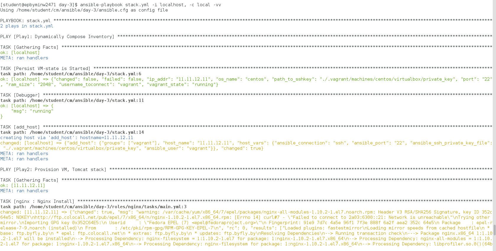
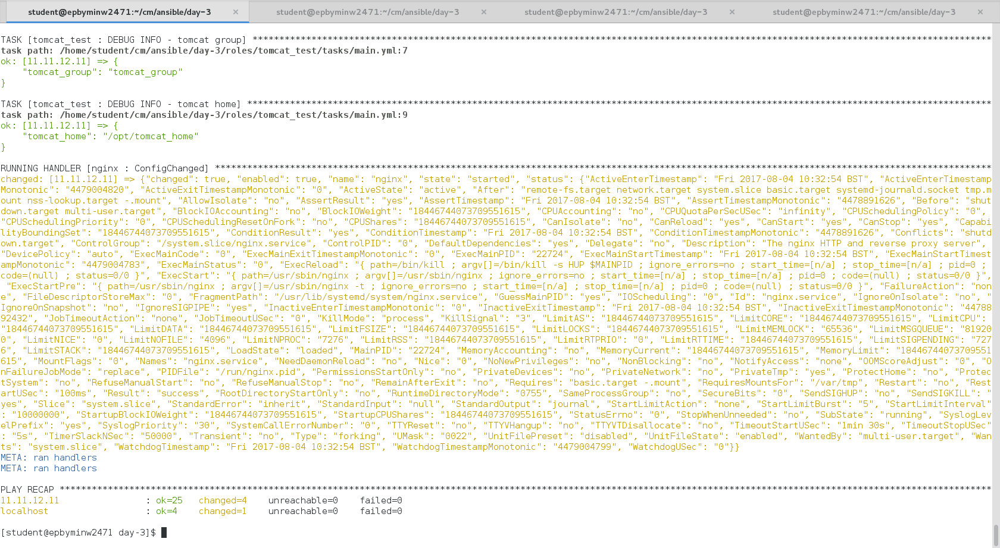

***Ansible Task 3: Vadzim Tarasiuk***

1. Create folder ~/cm/ansible/day-3. All working files are supposed to be placed right there.
2. Develop custom filter to select an url to download mongodb depends on OS name and S/W version from https://www.mongodb.org/dl/linux/

__Requirements:__

* Write a playbook (name: mongodb.yml) to prove that this module works
* At least 9 versions of MongoDB for 3 different Linux distributives (list with links)
* Filter should process a list of urls and takes 3 options: os_family (discovered by ansible, variable, produced by setup module), os release number and mongodb_version (set in play vars)

```
from __future__ import (absolute_import, division, print_function)
__metaclass__ = type

#from ansible import errors

#def mongodb_link(os_family, os_version, mongodb_version):
#    return "http://downloads.mongodb.org/linux/mongodb-linux-x86_64-%s%s-%s.tar.gz" type (os_family, os_version, mongodb_version)

def get_mongo_src(listOfLinks, os_family, os_version, mongodb_version):
  for each in listOfLinks:
    if os_family in each and os_version in each and mongodb_version in each:
      output = "mongodb-linux-x86_64-%s%s-%s" % (os_family, os_version, mongodb_version)
      return output
  return 42

class FilterModule(object):
    def filters(self):
        return {
            'get_mongo_src': get_mongo_src
       }
```

3. Develop custom module to manage VirtualBox:

__Arguments:__

* path to vagrantfile
* state: started, stopped, destroyed

__Return values:__

* state: running, stopped, not created
* ip address, port
* path to ssh key file
* username to connect to VM
* os_name
* RAM size
__Errors:__

* file doesn’t exists
* failed on creation
* etc

```
#!/bin/bash

#Traceback it, when called without params
source $1

usage="arguments: <path to Vagrantfile>, state <started|stopped|destroyed>"

path_without_dest=$(basename $path);
if [[ -d $path ]];
  then
  cd $path;
  if [[ ! -f "Vagrantfile" ]];
    then
    echo "No Vagrantfile found in $path"
    exit 0;
  fi
  cd -;
else
  folder_path=$(dirname $path);
  cd $folder_path;
  if [[ ! -f "$path_without_dest" ]];
    then
    echo "No Vagrantfile found in $path"
    exit 0; 
  else
    path=$folder_path;
  fi
  cd -;
fi

cd $path
get_status () {
a=$(vagrant status) 
if [[ `echo $a | grep "not created (virtualbox)"` > 0 ]]; 
  then    
  v_status="not created"  
elif [[ `echo $a | grep "running (virtualbox)"` > 0 ]]; 
  then    
  v_status="running"  
elif [[ `echo $a | grep "poweroff (virtualbox)"` > 0 ]]; 
  then    
  v_status="poweroff" 
fi  
}

set_status () {
  case "$1" in
    started)
      vagrant up
      ;;
    stopped)
      vagrant halt -f
      ;;
    destroyed)
      vagrant destroy -f
      ;;
      *)
      echo "$usage"
      exit 0;
      ;;
  esac
}

ip_addr () {
  ip_addr=$(cat $path/Vagrantfile | grep ip: | grep -oE "\b([0-9]{1,3}\.){3}[0-9]{1,3}\b");
}
username_toconnect () {
  username_toconnect="vagrant"
}
os_name () {
  os_name=$(cat $path/Vagrantfile | grep hostname | sed 's/^.*hostname = \"//' | sed 's/\"//');
}
ram_size () {
  ram_size=$(cat $path/Vagrantfile | grep memory | sed 's/^.*memory = \"//' | sed 's/\"//');
}
path_to_sshkey () {
  path_to_sshkey="./.vagrant/machines/$os_name/virtualbox/private_key";
}
port () {
  port=22
}

set_status $state
sleep 2s
get_status
os_name
path_to_sshkey
username_toconnect
ram_size
ip_addr
port

cd -

#Output Here
cat << EOF
{
  "changed": false,
  "failed": false, 
  "vagrant_state": "$v_status",
  "ip_addr": "$ip_addr",
  "port": "$port",
  "path_to_sshkey": "$path_to_sshkey",
  "username_toconnect": "$username_toconnect",
  "os_name": "$os_name",
  "ram_size": "$ram_size" 
}
EOF
```

4. Create a playbook (name: stack.yml) to provision Tomcat stack (nginx + tomcat) on VirtualBox VM

__Requirements:__

* 2 Plays: provision VM, roll out Tomcat stack (using roles from previous lab work)
* 2nd play should work with dynamically composed Inventory (connection settings to VM), http://docs.ansible.com/ansible/add_host_module.html

```
- name: "Play1: Dynamically Compose Inventory"
  hosts: localhost

  tasks:

  - name: Persist VM-state is Started
    vagrant_check: 
      path: /home/student/cm/ansible/day-3
      state: started
    register: info
  - name: Debugger
    debug: msg={{ info['vagrant_state'] }}

  - add_host:
      name: "{{ info['ip_addr'] }}"
      groups: "vagrant"
      ansible_port: "{{ info['port'] }}"
      ansible_connection: "ssh"
      ansible_user: "{{ info['username_toconnect'] }}"
      ansible_ssh_private_key_file: "{{ info['path_to_sshkey'] }}"
    when: info['vagrant_state'] == "running"


- name: "Play2: Provision VM, Tomcat stack"
  hosts: vagrant
  become: yes
  become_user: root

  roles: 
  - role: nginx
  - role: tomcat
  - role: tomcat_test
```

***The resulting output:***



