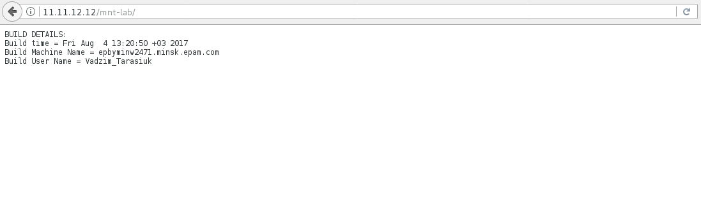
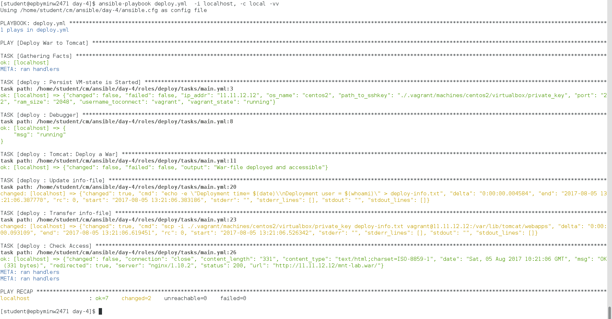

***Ansible Task 4: Vadzim Tarasiuk***

1. Create folder ~/cm/ansible/day-4. All working files are supposed to be placed right there.
2. Configure Ansible to use roles from ~/cm/ansible/day-3 folder

```
# additional paths to search for roles in, colon separated
roles_path    = /home/student/cm/ansible/day-3/roles
```

3. Build java sources with maven form here: https://github.com/sbeliakou/hello-war (MANUALLY)
* Requirements:

    __Update file src/main/resources/build-info.txt with following details:__

    * - Build time
    * - Build Machine Name
    * - Build User Name

Build command: 
```
$ mvn clean package -DbuildNumber=$VERSION
```
4. Develop a module for deploying resulted war file to Tomcat AS.
* Example:
* - deploy: url=... war=… username=… password=…

```bash
#!/bin/bash

source $1

usage="arguments: url=<server url>, war=<filename>, username=<admin>, password=<12345>";

stats_definer () {
	if [[ ( -z "$url" ) || ( -z "$war" ) || ( -z "$username") || ( -z "$password" )  ]];
		then
		echo $usage
		exit 0;
	fi
}

war_deployer () {
	war_name=$(basename $war)
	war_dir=$(dirname $war)
	curl -u "$username:$password" "$url/manager/text/undeploy?path=/$war_name"
	curl -u "$username:$password" --upload-file "$war_dir/$war_name" "$url/manager/text/deploy?path=/$war_name"
	output="War-file deployed and accessible"
}

stats_definer
war_deployer

#Output Here
cat << EOF
{
	"changed": false,
	"failed": false,
	"output": "$output"
}
EOF
```



__Requirements:__

 ***After deployment you should update file /var/lib/tomcat/webapps/deploy-info.txt***
 ***Add following details:***
  * - Deployment time
  * - Deploy User

```
- name: Update info-file
  shell: 'echo -e "Deployment time= $(date)\nDeployment user = $(whoami)" > deploy-info.txt'

- name: Transfer info-file
  shell: "scp -i {{ info['path_to_sshkey'] }} deploy-info.txt {{ info['username_toconnect'] }}@{{ info['ip_addr'] }}:/var/lib/tomcat/webapps"
```

5. Develop a playbook (name: deploy.yml) to deploy war file (role!), pass war-file as an extra-argument to playbook.

__Example:__
```
$ ansible-playbook deploy.yml … -e war=…
```

***Consider: Playbook should deploy war file and test that deployment was successful.***

* roles/deploy/tasks/main.yml
```
# tasks file for roles/deploy
- name: Persist VM-state is Started
  vagrant_check: 
    path: /home/student/cm/ansible/day-4
    state: started
  register: info
- name: Debugger
  debug: msg={{ info['vagrant_state'] }}

- name: "Tomcat: Deploy a War"
  deploy_module:
    url: "http://{{ info['ip_addr'] }}" 
    war: '{{ e_war }}'
    username: tomcat
    password: tomcat
    ipcheck: "{{ info['ip_addr'] }}"
  when: info['vagrant_state'] == "running"

- name: Update info-file
  shell: 'echo -e "Deployment time= $(date)\nDeployment user = $(whoami)" > deploy-info.txt'

- name: Transfer info-file
  shell: "scp -i {{ info['path_to_sshkey'] }} deploy-info.txt {{ info['username_toconnect'] }}@{{ info['ip_addr'] }}:/var/lib/tomcat/webapps"

- name: Check Access
  uri:
    url: "http://{{ info['ip_addr'] }}/{{ war_name }}"
    status_code: 200  
```

* deploy.yml
```
- name: "Deploy War to Tomcat"
  hosts: localhost
  roles:
  - role: deploy
  vars:
    e_war: "./hello-war/target/mnt-lab.war"
```



